<style>
pre {
    display: block;
    font-family: monospace;
    white-space: pre;
    margin: 1em 0px;
    margin-top: 0em;
    margin-right: 0px;
    margin-bottom: 0em;
    margin-left: 0px;
}
</style>

```{r setup, include=FALSE}
options(htmltools.dir.version = FALSE)
knitr::opts_chunk$set(cache.extra = knitr::rand_seed)
set.seed(3262020)
library(magrittr,cmcR)
```

```{r, load_refs, include=FALSE, cache=FALSE}
RefManageR::BibOptions(check.entries = FALSE,
           bib.style = "authoryear",
           cite.style = "alphabetic",
           style = "markdown",
           max.names = 2,
           no.print.fields = c("urldate","file","issn","url","keywords","language","abstract"),
           hyperlink = FALSE,
           dashed = FALSE)
myBib <- RefManageR::ReadBib("./ref.bib", check = FALSE)
```

#Overview

 - Motivation and Background Information
 
 - Pre-processing procedures
 
 - Cell-based comparison procedure
 
 - Congruent Matching Cells logic
 
 - Results & Discussion
 
 - Conclusion and Future Work

---
class: inverse, center, middle

# Motivation & Background Information

---

# Anatomy of a cartridge case

.pull-left[
1) Bullet

2) Cartridge case

3) Propellant

4) Rim

5) Primer
]

.pull-right[
```{r echo=FALSE,eval=TRUE,fig.align='right'}
knitr::include_graphics(path = "images/cartridgeCaseDiagram.png",dpi = 200)
```
]

.footnote[
[Image Source](https://commons.wikimedia.org/wiki/File:Bulletfixed.PNG)
]

---

# Breech face impressions

 - During firing process, cartridge case hits back wall (*breech face*) of barrel

 - Contact often "stamps" breech face markings onto cartridge case primer/base
 
.pull-left[
```{r echo=FALSE,eval=TRUE,fig.align='right',out.height=300,out.width=400}
knitr::include_graphics(path = "images/firearmBreechFace.png")
```
]

.pull-right[
```{r echo=FALSE,eval=TRUE,fig.align='right',out.height=300,out.width=400}
knitr::include_graphics(path = "images/cartridgeCasePrimer.png")
```
]

.footnote[
[Images Source](http://www.firearmsid.com/A_CCIDImpres.htm)
]

---
#Breech face vs. firing pin impressions

```{r echo=FALSE,eval=TRUE,fig.align='center',fig.retina=2.5}
knitr::include_graphics(path = "images/primerBFImpressionDiagram.png")
```

.footnote[
[Image Source](https://pdfs.semanticscholar.org/f2ab/001b090f2fcb79eff7a83b8aafeb81909944.pdf?_ga=2.260252488.476104195.1585242193-1176892230.1581362963)
]

---
# Cartridge Case Surface Matrices

```{r echo=TRUE,eval=TRUE,strip.white=TRUE}
fadul1.1 <- x3ptools::read_x3p("data/Fadul 1-1.x3p")
```
```{r eval=FALSE}
x3ptools::image_x3p(fadul1.1)
```

```{r eval=TRUE,echo=FALSE,fig.align='center',fig.height=6}
#alternative:
fadul1.1 %>%
  # x3ptools::sample_x3p(m = 8) %>%
  .$surface.matrix %>%
  imager::as.cimg() %>%
  plot()
```

---

# Congruent Matching Cells method

 - Some regions of cartridge case contain strong *ballistic signature*
 
 - Comparing entire scans may not highlight "valid correlation areas"<sup>[1]</sup>
 
 - Number of matching cells is a more granular similarity metric

```{r echo=FALSE,eval=TRUE,fig.align='center',fig.retina=2}
knitr::include_graphics(path = "images/im1_im2_cellComparison.png")
```

.footnote[
<!-- [1] [Song (2013)](https://tsapps.nist.gov/publication/get_pdf.cfm?pub_id=910868) -->
[1] `r RefManageR::Citet(myBib,7)`
]

---
#Congruent Matching Cells method

- Two cartridge case scans can be rotationally and translationally aligned.
 
    - $\pmb{\beta} \equiv (dx,dy,\theta)' \in \mathbb{R} \times \mathbb{R} \times [0,2\pi)$ aligns Matrix 1 to Matrix 2

- Cartridge case's cells can also be aligned

    - $\pmb{\beta}_i \equiv (dx_i,dy_i,\theta_i)', i = 1,...,n$ for $n$ total cells

--

- We expect $\pmb{\beta}_i = \pmb{\beta}, \forall i = 1,...,n$ for true matches
 
- It's much easier to determine whether $\hat{\pmb{\beta}}_i \approx \hat{\pmb{\beta}}_j, i \neq j$
 
--
 
- Use estimated alignment parameters, $\hat{\pmb{\beta}}_i$, as features to classify matches 

---
#Congruent Matching Cells method

```{r echo=FALSE}
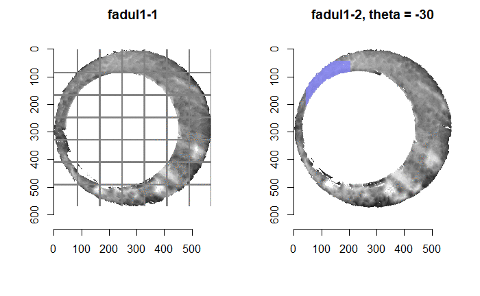
```

---
class: inverse, middle, center

# Pre-processing procedures

---

# Pre-processing goals

1) Remove regions of scan that do not contain breech face impressions
 
- Preferably do so automatically
     
2) Highlight remaining breech face impressions via Gaussian filtering
 

```{r echo=FALSE,fig.retina=3.5,fig.align='center'}
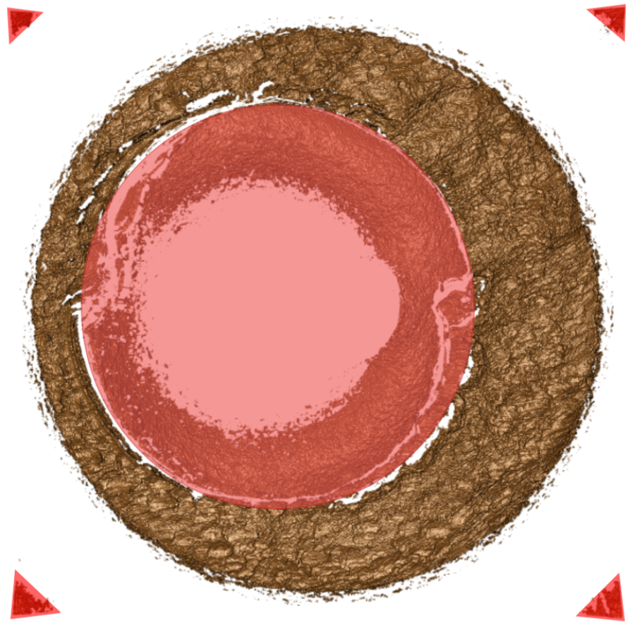
```

---

# 1. Identify BF impression height value

- RANSAC<sup>[1]</sup> (Random Sample Consensus) robust, iterative plane-fitting
    
```{r echo=FALSE,fig.retina=3,fig.align='center'}
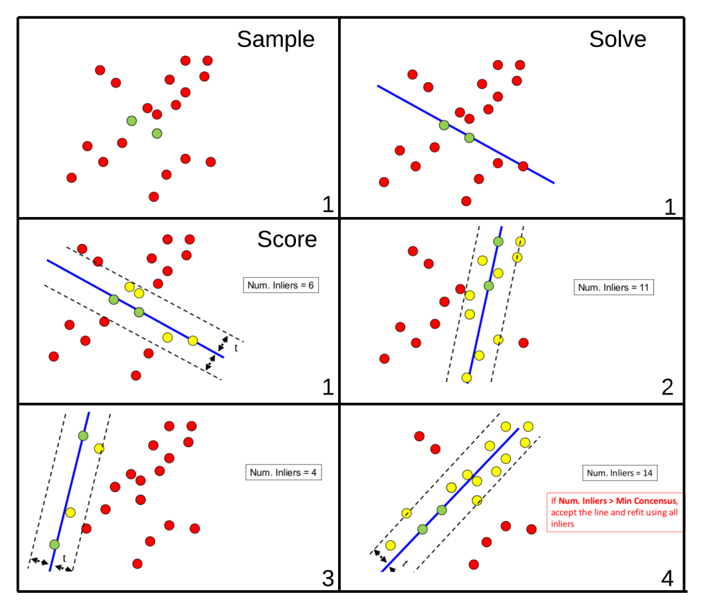
```

.footnote[
[1] `r RefManageR::Citet(myBib,4)`, [Image Source](https://bitesofcode.wordpress.com/tag/opencv/)
]

---

#1. Identify BF impression height value

- Use RANSAC method to identify BF impression height value in scan

    - Take residuals between fitted plane and observed values within the final selection threshold specified
    
    - Or, take observed values within final selection threshold

```{r cache=TRUE}
fadul1.1 <- x3ptools::read_x3p("data/Fadul 1-1.x3p") %>%
  x3ptools::sample_x3p(m = 2)

fadul1.1$surface.matrix <- fadul1.1$surface.matrix %>%
  cmcR::preProcess_ransac(inlierTreshold = 10^-5,
                          finalSelectionThreshold = 2*(10^-5),
                          iters = 150) %>%
  cmcR::preProcess_levelBF(useResiduals = TRUE)
```

---
#1. Identify BF impression height value

- Note: relies on randomly sampling surface matrix, so results may differ between uses

```{r eval=TRUE,echo=FALSE,fig.align='center',fig.height= 6.5}
#alternative:
fadul1.1 %>%
  # x3ptools::sample_x3p(m = 8) %>%
  .$surface.matrix %>%
  imager::as.cimg() %>%
  plot()
```

---
#2. Removing "minutiae"

- Crop-out whitespace exterior to cartridge case scan

```{r cache=TRUE}
fadul1.1$surface.matrix <- fadul1.1$surface.matrix %>%
  cmcR::preProcess_cropWS(croppingThresh = 2)
```
```{r echo=FALSE,fig.align='center',fig.height=6,cache=TRUE}
fadul1.1$surface.matrix %>%
  imager::as.cimg() %>%
  plot()
```


---
#2. Removing "minutiae" - Hough transform

- Need to "detect" firing pin impression circle in arbitrary scan

    <!-- - Note: Glocks have rectangular firing pins, so doesn't necessarily generalize -->
    
- Hough transform<sup>[1]</sup> voting-based shape detection technique

```{r echo=FALSE,fig.align='center'}
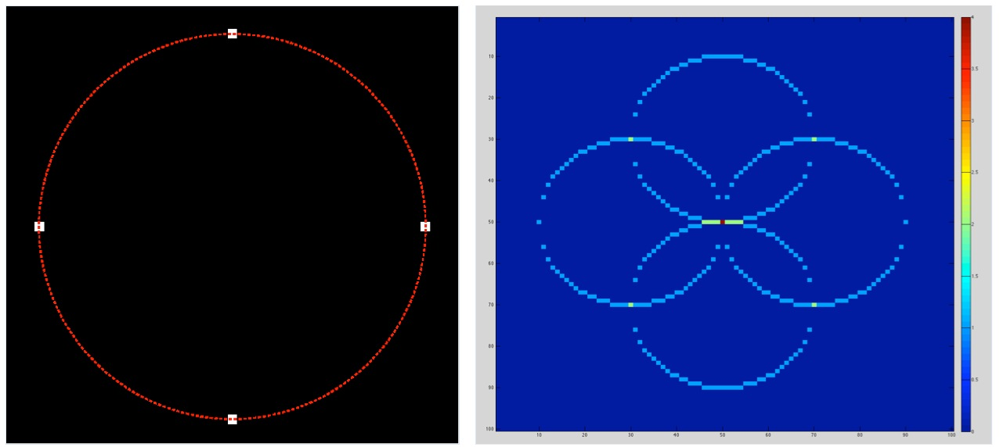
```

.footnote[
[1] `r RefManageR::Citet(myBib,9)`, [Image Source](https://commons.wikimedia.org/wiki/File:Circle\_Hough_transform\_of\_four\_points\_on\_a\_circle.jpg)
]

---
#2. Removing "minutiae" - Hough transform

- Hough transform detects circle center given a radius

- Count number of non-`NA` observations per row/column and find modes

```{r echo=FALSE,fig.align='center',dpi=190,cache=TRUE}
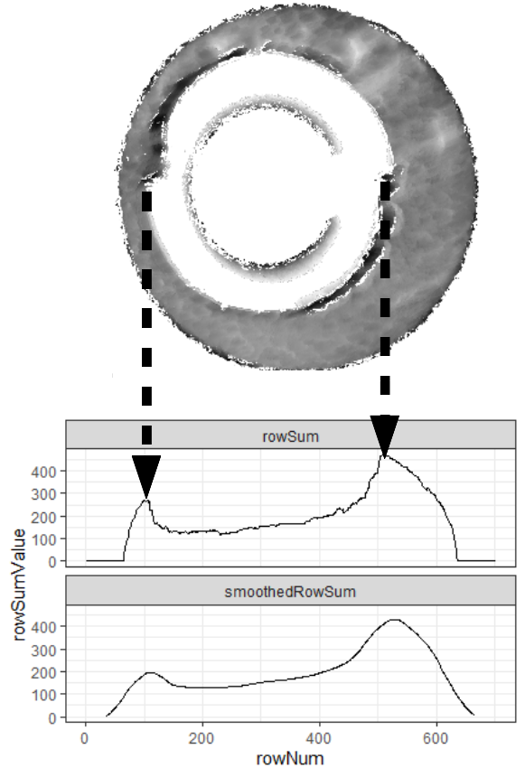
```

???
- The Hough transform methom will detect the center of a circle in a matrix given a radius
 - The difficulty of this is that we don't *know* the radius ahead of time. Thus, it needs to be estimated
- To estimate the radius, we can count the number of non-NA (gray) elements per row/column of the matrix and determine when this count attains modes.
 - The image shown illustrates how the non-NA count changes with the rows/columns of the matrix.
 - We actually consider a moving average-smoothed version of the non-NA count to identify the modes.
 - The distance between the two modes provides an estimate for the diameter, and thus the radius.
---
#2. Removing "minutiae" - Hough transform

- Estimate radius values for various rotations of scan

.pull-left[
.center[All "votes"]
```{r echo=FALSE,cache=TRUE}
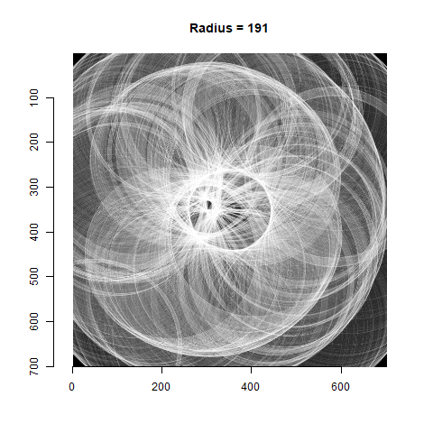
```
]
.pull-right[
.center[Most popular "vote"]
```{r echo=FALSE,cache=TRUE}
knitr::include_graphics("images/houghTransformFilter.gif")
```
]

???
- We can obtain a number of estimates for the radius using the method described on the previous slide.
- We use each radius estimate to fit a Hough transform.
- Each frame of the gif on the left represents the "votes" cast for different centers in the image for a particular radius value
- Each frame of the gif on the right shows the location of the estimated firing pin circle - in particular which pixels are filtered out
---
#2. Removing "minutiae" - Hough transform

- Each radius value assigned "score" indicating strength of evidence

- Use Hough transform score to determine range of "confident" radius values

```{r echo=FALSE,fig.align='center',cache=TRUE,fig.retina=2}
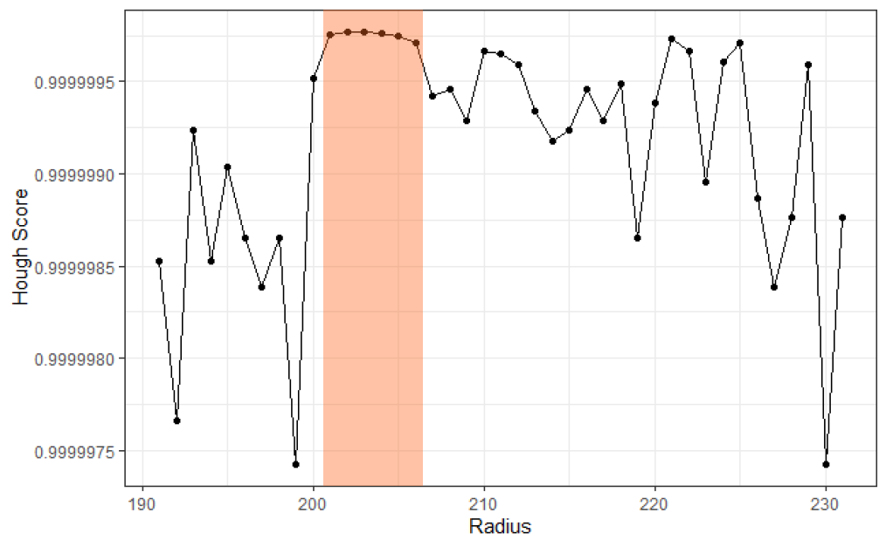
```

???
- We need some way to ultimately decide on a particular firing pin circle based on the estimates
- The Hough transform has a normalized score computed from the number of votes cast for a particular center
 - We can use these scores to quantify how "confident" in a particular center the Hough transform is
 - It's natural to take the center with the largest Hough score as the best estimate for a particular radius
- The max Hough score varies considerably depending on the radius considered.
 - The plot shows how the max Hough score varies by radius value
 - We can identify radius values where the max Hough score is "stable" and consistently high
 - The plot shows a range of values between radii 201 and 206 that have stable, high max Hough scores
 - We can then choose, say, the middle of this range of values as the final radius estimate
---
#2. Removing "minutiae" - Hough transform

```{r cache=TRUE}
fadul1.1$surface.matrix <- fadul1.1$surface.matrix %>%
  cmcR::preProcess_removeFPCircle() 
```
```{r echo=FALSE,fig.align='center',fig.height=6,cache=TRUE}
fadul1.1$surface.matrix %>%
  imager::as.cimg() %>%
  plot()
```

---
#3. Gaussian filtering

- "Low-frequency", global structure due to, e.g., manufacturing specs

- "High-frequency" noise due to, e.g., scanning process

--

- Goal is to match cartridge cases based on *breech face impressions*, not on whether they share a manufacturer

- False positive rate likely to increase if these structures aren't removed

--

- Gaussian filtering reduces effects of large and small-scale structure

---
#3. Gaussian filtering

- Lowpass filtering = "smoothing"

    - Gaussian-weighted moving average

--

- Highpass filtering = "sharpening"

    - Subtract complementary lowpass-filtered matrix

--

- Bandpass filtering = highpass followed by lowpass

--

- Target signals of particular frequency by controlling Gaussian standard deviation

    - Larger s.d. = averaging over more observations = "smoother" output

---
#3. Gaussian filtering

```{r echo=TRUE,cache=TRUE}
fadul1.1$surface.matrix <- fadul1.1$surface.matrix %>%
  cmcR::preProcess_gaussFilter(res = fadul1.1$header.info$incrementY,
                               wavelength = c(16,250),
                               filtertype = "bp")
```
```{r echo=FALSE,fig.align='center',fig.height=5.5,cache=TRUE}
fadul1.1$surface.matrix %>%
  imager::as.cimg() %>%
  plot()
```


---
#Pre-processing procedures conclusion

- Pre-processing procedures affect final results

- Methods used by some authors are still unavailable

    - Second-order robust Gaussian regression filter

    - Exact implementations may never be available

---
class: inverse, middle, center

# Cell-based comparison procedure

---
#Cross-correlation function

- For real-valued, bivariate funtions $f(x,y),g(x,y)$ for $x,y \in \mathbb{R}$, *cross-correlation function* (CCF) is

$$(f \star g)(x,y) := \int_{-\infty}^\infty \int_{-\infty}^\infty f(t,s) g(t + x,s + y)\ dtds$$

--

- **Discrete analogue:** For two discrete, bivariate functions $A[m,n], B[m,n]$ for $m,n \in \mathbb{Z}$, the CCF is

$$(A \star B)[m,n] := \sum_{i = -\infty}^\infty \sum_{j = -\infty}^\infty A[i,j] B[i + m,j + n]$$

--

- Think of $A[m,n]$ as $m$th row and $n$th column of matrix $A$

---
#Cross-correlation theorem

- Calculating CCF by definition is computationally infeasible

--

- By the Cross-correlation theorem,
$$A \star B = \mathcal{F}^{-1}\left(\overline{\mathcal{F}(A)} \cdot \mathcal{F}(B)\right)$$
 - $\mathcal{F}(\cdot)$ denotes Fourier transform
 
 - $\mathcal{F}^{-1}(\cdot)$ denotes inverse Fourier transform

 - $\overline{f}$ denotes complex conjugate of function $f$
 
 - multiplication on RHS is pointwise (Hadamard) multiplication

--

- *Fast Fourier Transform* drastically improves computational efficiency<sup>[1]</sup>

.footnote[
[1] `r RefManageR::Citet(myBib,5)`
]

---
#Aligning by CCF

- CCF indicates how one matrix should be translated to align with another

$$\text{CCF}_{\max} := \max_{m,n} \mathcal{F}^{-1}\left(\overline{\mathcal{F}(A)} \cdot \mathcal{F}(B)\right)[m,n]$$

$$[m^*,n^*] := \arg\max_{m,n} \mathcal{F}^{-1}\left(\overline{\mathcal{F}(A)} \cdot \mathcal{F}(B)\right)[m,n]$$

--

- Note: this method requires replacing missing/`NA` values

 - $\text{CCF}_{\max}$ values are often "deflated" for cartridge case scans
 
 - $[m^*,n^*]$ are often good estimates of "correct" translation parameters
 
--
 
- "True" $\text{CCF}_{\max}$ value, without replacing `NA`s, can be determined after aligning matrices by $[m^*,n^*]$

---
#Aligning by CCF - example

.pull-left[
```{r echo=FALSE,fig.align='center'}
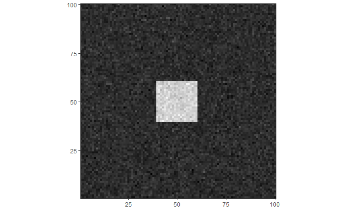
```
]

.pull-right[
```{r echo=FALSE,fig.align='center'}
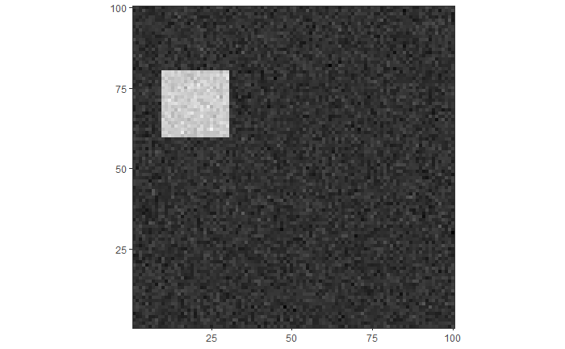
```
]

```{r echo=FALSE,fig.align='center',dpi=170}
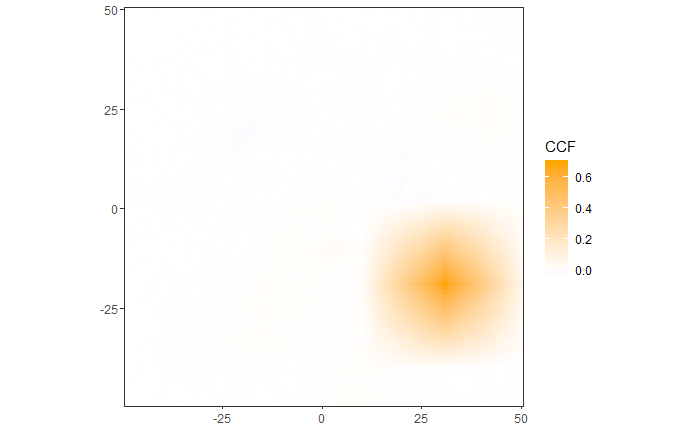
```

---
# Cell-based comparison procedure

```{r echo=FALSE,eval=TRUE,fig.align='center'}
knitr::include_graphics(path = "images/im1_im2_cellComparison.png")
```

---
# Cell-based comparison procedure

1) Partition surface matrix 1 into grid of cells

--

2) Pair each cell with larger "region" in surface matrix 2 such that their center indices coincide.

--

3) For each rotation value:

- Rotate surface matrix 2 using linear interpolation scheme
  
--
    
- Remove from consideration cell/region pairs with too few observed values
  
--

- Shift and/or scale cells/regions (e.g., by respective average and/or standard deviation)
  
--
    
- Replace `NA` values with 0

--

- Calculate maximum cross-correlation function and associated $(dx,dy)'$ values using a FFT-based method


---
#Cell-based comparison procedure

3) For each rotation value:

- Using $(dx,dy)'$ values, calculate pairwise-complete correlation between cell and a cell-sized matrix extracted from surface matrix 2

```{r echo=FALSE,fig.align='center',dpi=180}
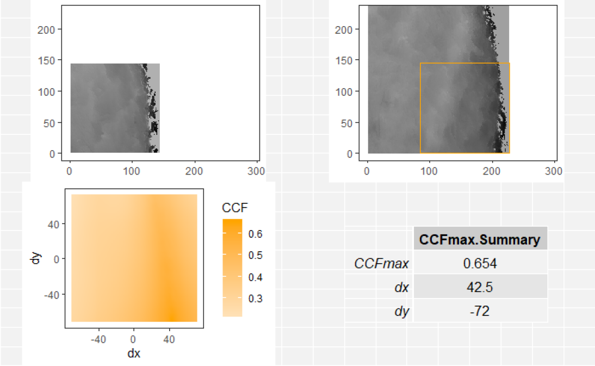
```

---
# Cell-based comparison procedure

```{r echo=FALSE,eval=TRUE,cache=TRUE}
fadul1.2 <- x3ptools::read_x3p("~/bulletCartridgeScans/fadul_allScans/Fadul_1/cc/Fadul 1-2.x3p") %>%
  x3ptools::sample_x3p(m = 2)

fadul1.2$surface.matrix <- fadul1.2$surface.matrix %>%
  cmcR::preProcess_ransac(inlierTreshold = 10^-5,
                          finalSelectionThreshold = 2*(10^-5),
                          iters = 150) %>%
  cmcR::preProcess_levelBF(useResiduals = TRUE) %>%
  cmcR::preProcess_cropWS(croppingThresh = 2) %>%
  cmcR::preProcess_removeFPCircle() %>%
  cmcR::preProcess_gaussFilter(res = fadul1.2$header.info$incrementY,
                               wavelength = c(16,250),
                               filtertype = "bp")
```

```{r echo=TRUE,cache=TRUE}
comparison1 <- cmcR::cellCCF(fadul1.1,
                             fadul1.2,
                             thetas = seq(-30,30,by = 3),
                             cellNumHoriz = 8,
                             regionToCellProp = 4,
                             minObservedProp = .15,
                             centerCell = "individualCell",
                             scaleCell = "individualCell")
```
```{r eval=FALSE}
comparison1$ccfResults$`-30`
```


```{r echo=FALSE}
comparison1$ccfResults$`-30` %>%
  knitr::kable(format = "html") %>%
  kableExtra::kable_styling() %>%
  kableExtra::scroll_box(height = "200px")
```


---
class: inverse, middle, center

# Congruent Matching Cells logic

---
# Initially proposed method

- For each cell/region pair, determine alignment parameter estimates at which max CCF occurs

    - $\hat{\pmb{\beta}}_{\max,i}$ for $i = 1,....,n$ cells


```{r cache=TRUE}
topResults <- cmcR::topResultsPerCell(comparison1$ccfResults)
```

---
#Initially proposed method
```{r eval=FALSE}
topResults
```
```{r echo=FALSE}
topResults %>%
  dplyr::arrange(cellNum) %>%
  knitr::kable(format = "html") %>%
  kableExtra::kable_styling() %>%
  kableExtra::scroll_box(height = "400px")
# DT::datatable(topResults,
#               fillContainer = TRUE)
```

---
# Initially proposed method

- Determine "consensus" among these values, $\bar{\pmb{\beta}}$, by, e.g., taking their median

--

- Classify cell pair as "congruent matching" if associated alignment parameter estimates are close to consensual values

    - $\left\lvert\hat{\pmb{\beta}}_{\max,i} - \bar{\pmb{\beta}}\right\rvert \leq \pmb{T}$ for thresholds $\pmb{T}$.

--

- Issue: initially proposed method only allows cell pairs to "vote" for a single alignment parameter combination

---
#Initially proposed method

```{r cache=TRUE}
initialCMCs <- topResults %>%
  cmcR::cmcFilter(consensus_function = median,
                  ccf_thresh = .6,
                  dx_thresh = 10,
                  theta_thresh = 3)
```
```{r eval=FALSE}
initialCMCs #8 initial CMCs
```

```{r echo=FALSE}
initialCMCs %>%
  dplyr::arrange(cellNum) %>%
  knitr::kable(format = "html") %>%
  kableExtra::kable_styling() %>%
  kableExtra::scroll_box(height = "300px")
```
 
---
# "Improved" method

- Cell pair may be highly similar at true $\pmb{\beta}$, but happened to not vote for it

--

- Use extracted features more advantageously & perform comparisons in both "directions" <sup>[1]</sup>

.footnote[
[1] `r RefManageR::Citet(myBib,6)`
]

--

- Count CMCs for each rotation value and identify CMC modes

    - Determine "high" CMC threshold, $\text{CMC}_{\text{high}} = \text{CMC}_{\max} - \tau$ for some $\tau$
    
    - Find $\theta$ value furthest from $\text{CMC}_{\max}$ value with associated count greater than or equal to $\text{CMC}_{\text{high}}$

--

- If modes are too far from each other, then cell pair likely not a match

---
class: center
**Known match**
```{r echo=FALSE,fig.align='center',dpi=150}
knitr::include_graphics("images/kmCMCpertheta.png")
```

**Known non-match**
```{r echo=FALSE,fig.align='center',dpi=150}
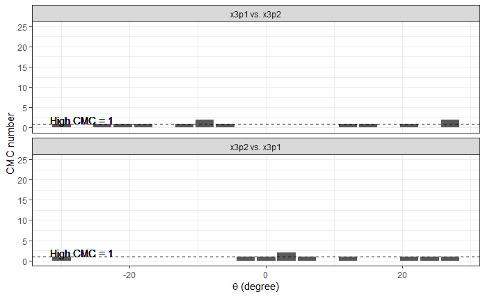
```


---
# "Improved" method

- If CMC modes are too far from each other, then assign CMC count based on initially proposed method

- Otherwise, count CMCs within `theta_thresh` of the CMC mode for both comparison directions, excluding replicates

```{r echo=TRUE,cache=TRUE}
comparison2 <- cmcR::cellCCF_bothDirections(fadul1.1,fadul1.2,
                                            thetas = seq(-30,30,by = 3),
                                            cellNumHoriz = 8,
                                            regionToCellProp = 4,
                                            minObservedProp = .15,
                                            centerCell = "individualCell",
                                            scaleCell = "individualCell")

cmc <- comparison2 %>%
  cmcR::cmcFilter_improved(consensus_function = median,
                           ccf_thresh = .6,
                           dx_thresh = 10,
                           theta_thresh = 3)
```


---
# "Improved" method

```{r eval=FALSE}
cmc$finalCMCs #24 final CMCs
```
```{r echo=FALSE}
cmc$finalCMCs %>%
  dplyr::arrange(cellNum) %>%
  knitr::kable(format = "html") %>%
  kableExtra::kable_styling() %>%
  kableExtra::scroll_box(height = "400px")
```


---
```{r echo=TRUE,fig.height=3.2,fig.align='center',cache=TRUE}
cmcR::cmcPlot(fadul1.1,cmcDF = cmc$initialCMCs[[1]],method = "ggplot2")
```

```{r echo=TRUE,fig.height=3.2,fig.align='center',cache=TRUE}
cmcR::cmcPlot(fadul1.1,cmcDF = cmc$finalCMCs,method = "ggplot2")
```


---
class: inverse, middle, center

# Results & Discussion

---
#Results & Discussion

- Fadul et al. cartridge case scans<sup>[1]</sup>
    
    - 63 known match (KM) pairs, 717 known non-match (KNM) pairs

.footnote[
[1] `r RefManageR::Citet(myBib,8)`
]

--

- Goal: Separation between KM and KNM CMC count distributions

--

- Sensitivity analysis under various pre, inter, and post-processing conditions

--

- Promising conditions are those used in this presentation

---
#Initially proposed method results

```{r echo=FALSE,fig.align='center',dpi = 170}
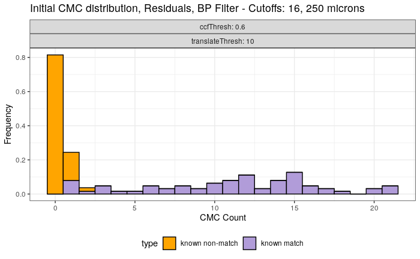
```

```{r echo=FALSE,fig.align='center',dpi = 170}
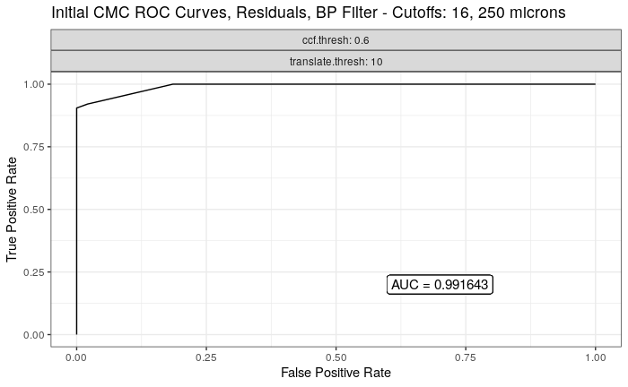
```

---
# Initially proposed method discussion

- Perfect classification achieved under other classification thresholds<sup>[1]</sup>

.footnote[
[1] See appendix slides

[2] `r RefManageR::Citet(myBib,3)`
]

--

- Tong et al. achieve better separation of KM and KNM CMC distributions<sup>[2]</sup>

 - Distance between max KNM count and min KM count
 
 - More informative diagnostic metrics may exist

---
#Improved method results

```{r echo=FALSE,fig.align='center',dpi = 170}
knitr::include_graphics("images/finalCMCdistributions.png")
```

```{r echo=FALSE,fig.align='center',dpi = 170}
knitr::include_graphics("images/finalCMCroc.png")
```

---
#Improved method discussion

- Improved method tends to assign higher CMC count to both KM and KNM

- More "false positive" CMCs assigned to KNM than other authors<sup>[1]</sup>

.footnote[
[1] `r RefManageR::Citet(myBib,2)`
]

---
# Results & Discussion

- Perfect classification achieved using both methods

 - Dependent on filtering thresholds

--
 
- Other authors able to achieve better separation

--

- Explore small changes to methodology (e.g., parameter tuning)

---
class: inverse, middle, center

# Conclusions & Future Work

---
#Conclusions

- Results indicate a close implementation of proposed CMC methods

- Main issues related to separation between KM and KNM distributions

- Tuning of pre, inter, and post-processing conditions will undoubtedly lead to results closer to those of other authors

- Conditions used in this presentation are current `cmcR` package defaults

---
#Future Work

- **Short-term:**

    - `R` Journal submission

    - `cmcR` package submission to CRAN

- **Longer-term:**

    - CMC method improvments:
     - techniques for dealing with `NA`s
     - better classification diagnostics
     - implementation of closed-source methods

    - Principled approach to quantifying and/or modeling similarity

---
#References
```{r refs1, echo=FALSE, results="asis"}
RefManageR::PrintBibliography(myBib,end = 4)
```

---
#References (cont'd.)

```{r refs2, echo=FALSE, results="asis"}
RefManageR::PrintBibliography(myBib,start = 5)
```


---

class: center, middle

# Questions?

---
class: center, middle

# Thank you!

---
class: center, inverse, middle

# Appendix

---
# Initially proposed method perfect classif.

```{r echo=FALSE,fig.align='center',dpi = 170}
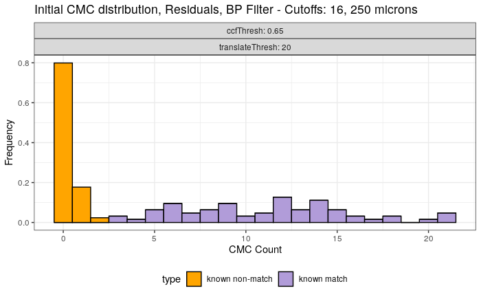
```

```{r echo=FALSE,fig.align='center',dpi = 170}
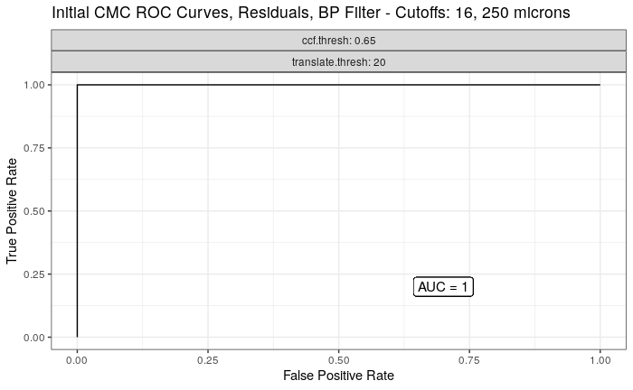
```

---
# Initial method CMC dist'n sensitivity

```{r echo=FALSE,fig.align='center'}
knitr::include_graphics("images/initialCMCResidualsBP16_250plot_corr30-90_trans10-30_noAUC.png",dpi = 500)
```

---
# Initial method ROC curve sensitivity

```{r echo=FALSE,fig.align='center'}
knitr::include_graphics("images/roc_initialCMC_residualsBP16-250_corr30-90_trans10-30.png",dpi = 500)
```


---
# Improved method CMC dist'n sensitivity

```{r echo=FALSE,fig.align='center'}
knitr::include_graphics("images/cmcResidualsBP16_250_corr30-90_trans10-30_noAUC.png",dpi = 500)
```

---
# Improved method ROC curve sensitivity

```{r echo=FALSE,fig.align='center'}
knitr::include_graphics("images/roc_residualsBP16-250.png",dpi = 500)
```
