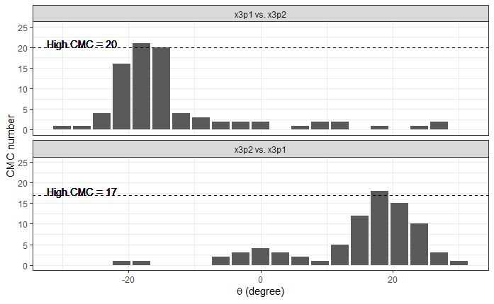

<style>
pre {
    display: block;
    font-family: monospace;
    white-space: pre;
    margin: 1em 0px;
    margin-top: 0em;
    margin-right: 0px;
    margin-bottom: 0em;
    margin-left: 0px;
}
</style>

```{r setup, include=FALSE}
options(htmltools.dir.version = FALSE)
knitr::opts_chunk$set(cache.extra = knitr::rand_seed)
set.seed(3262020)
library(magrittr,cmcR)
```

#Overview

 - Motivation and Background Information
 
 - Pre-processing procedures
 
 - Cell-based comparison procedure
 
 - Congruent Matching Cells logic
 
 - Results & Discussion
 
 - Conclusion and Future Work

---
class: inverse, center, middle

# Motivation & Background Information

---

# Anatomy of a cartridge case

.pull-left[
1) Bullet

2) Cartridge case

3) Propellant

4) Rim

5) Primer
]

.pull-right[
```{r echo=FALSE,eval=TRUE,fig.align='right'}
knitr::include_graphics(path = "images/cartridgeCaseDiagram.png",dpi = 200)
```
]

.footnote[
[1] [Image Source](https://commons.wikimedia.org/wiki/File:Bulletfixed.PNG)
]

<!-- --- -->
<!-- background-image: url(`r xaringan:::karl`) -->
<!-- background-position: 50% 50% -->
<!-- class: center, bottom, inverse -->

<!-- # You only live once! -->

---

# Breech face impressions

 - Cartridge case slams into back wall (i.e., *breech face*) of barrel

 - Contact often "stamps" breech face markings onto cartridge case primer/base
.pull-left[
```{r echo=FALSE,eval=TRUE,fig.align='right',out.height=300,out.width=400}
knitr::include_graphics(path = "images/firearmBreechFace.png")
```
]

.pull-right[
```{r echo=FALSE,eval=TRUE,fig.align='right',out.height=300,out.width=400}
knitr::include_graphics(path = "images/cartridgeCasePrimer.png")
```
]

.footnote[
[1] [Images Source](http://www.firearmsid.com/A_CCIDImpres.htm)
]

---
#Breech face vs. firing pin impressions

```{r echo=FALSE,eval=TRUE,fig.align='center',fig.retina=2.5}
knitr::include_graphics(path = "images/primerBFImpressionDiagram.png")
```

.footnote[
[1] [Image Source](https://pdfs.semanticscholar.org/f2ab/001b090f2fcb79eff7a83b8aafeb81909944.pdf?_ga=2.260252488.476104195.1585242193-1176892230.1581362963)
]

---
# Cartridge Case Surface Matrices

```{r echo=TRUE,eval=TRUE,strip.white=TRUE}
fadul1.1 <- x3ptools::read_x3p("data/Fadul 1-1.x3p")
```
```{r eval=FALSE}
x3ptools::image_x3p(fadul1.1)
```

```{r eval=TRUE,echo=FALSE,fig.align='center',fig.height=6}
#alternative:
fadul1.1 %>%
  # x3ptools::sample_x3p(m = 8) %>%
  .$surface.matrix %>%
  imager::as.cimg() %>%
  plot()
```

---

# Congruent Matching Cells method

 - Some regions of cartridge case contain strong *ballistic signature*
 
 - Comparing entire scans may not highlight "valid correlation areas"
 
 - Number of matching cells is a more granular similarity metric

```{r echo=FALSE,eval=TRUE,fig.align='center',fig.retina=2}
knitr::include_graphics(path = "images/im1_im2_cellComparison.png")
```

.footnote[
[1] [Song (2013)](https://tsapps.nist.gov/publication/get_pdf.cfm?pub_id=910868)
]

---
#Congruent Matching Cells method

- Two cartridge case scans can be rotationally and translationally aligned.
 
    - $\pmb{\beta} \equiv (dx,dy,\theta)' \in \mathbb{R} \times \mathbb{R} \times [0,2\pi)$ aligns Matrix 1 to Matrix 2

- Cartridge case's cells can also be aligned

    - $\pmb{\beta}_i \equiv (dx_i,dy_i,\theta_i)', i = 1,...,n$ for $n$ total cells

--

- We expect $\pmb{\beta}_i = \pmb{\beta}, \forall i = 1,...,n$ for true matches
 
- We can realistically only determine if $\hat{\pmb{\beta}}_i \approx \hat{\pmb{\beta}}_j, i \neq j$
 
--
 
- Use estimated alignment parameters as features to classify matches 

---
#Congruent Matching Cells method

```{r echo=FALSE}
knitr::include_graphics("images/bfRotationComparison.gif")
```

---
class: inverse, middle, center

# Pre-processing procedures

---

# Pre-processing goals

1) Remove regions of scan that do not contain breech face impressions
 
- Preferably do so automatically
     
2) Highlight remaining breech face impressions via Gaussian filtering
 

```{r echo=FALSE,fig.retina=3.5,fig.align='center'}

```

---

# 1. Identify BF impression height value

- RANSAC (Random Sample Consensus) robust, iterative plane-fitting
    
```{r echo=FALSE,fig.retina=3,fig.align='center'}
knitr::include_graphics("images/ransacMethod.png")
```

.footnote[
[1] [Image Source](https://bitesofcode.wordpress.com/tag/opencv/)
]

---

#1. Identify BF impression height value

- Use RANSAC method to identify BF impression height value in scan

    - Take residuals between fitted plane and observed values within the final selection threshold specified
    
    - Or, take observed values within final selection threshold

```{r cache=TRUE}
fadul1.1 <- x3ptools::read_x3p("data/Fadul 1-1.x3p") %>%
  x3ptools::sample_x3p(m = 2)

fadul1.1$surface.matrix <- fadul1.1$surface.matrix %>%
  cmcR::preProcess_ransac(inlierTreshold = 10^-5,
                          finalSelectionThreshold = 2*(10^-5),
                          iters = 150) %>%
  cmcR::preProcess_levelBF(useResiduals = TRUE)
```

---
#1. Identify BF impression height value

- Note: relies on randomly sampling surface matrix, so results may differ between uses

```{r eval=TRUE,echo=FALSE,fig.align='center',fig.height= 6.5}
#alternative:
fadul1.1 %>%
  # x3ptools::sample_x3p(m = 8) %>%
  .$surface.matrix %>%
  imager::as.cimg() %>%
  plot()
```

---
#2. Removing "minutiae"

- Crop-out whitespace exterior to cartridge case scan

```{r cache=TRUE}
fadul1.1$surface.matrix <- fadul1.1$surface.matrix %>%
  cmcR::preProcess_cropWS(croppingThresh = 2)
```
```{r echo=FALSE,fig.align='center',fig.height=6,cache=TRUE}
fadul1.1$surface.matrix %>%
  imager::as.cimg() %>%
  plot()
```

- Remove observations within firing pin impression circle

---
#2. Removing "minutiae" - Hough Transform

- Need to "detect" firing pin impression circle in arbitrary scan

    - Note: Glocks have rectangular firing pins, so doesn't necessarily generalize
    
- Hough transform is a voting-based shape detection technique

```{r echo=FALSE,fig.align='center'}

```

---
#2. Removing "minutiae" - Hough Transform

- Need to estimate radius for arbitrary scan

- Count number of non-`NA` observations per row/column and find modes

```{r echo=FALSE,fig.align='center',dpi=190,cache=TRUE}

```


---
#2. Removing "minutiae" - Hough Transform

- Estimate radius values for various rotations of scan

.pull-left[
```{r echo=FALSE,cache=TRUE}
knitr::include_graphics("images/accumulator.gif")
```
]
.pull-right[
```{r echo=FALSE,cache=TRUE}
knitr::include_graphics("images/houghTransformFilter.gif")
```
]

---
#2. Removing "minutiae" - Hough Transform

- Each radius value assigned "score" indicating strength of evidence

- Use Hough transform score to determine range of "confident" radius values

```{r echo=FALSE,fig.align='center',cache=TRUE,fig.retina=2}

```

---
#2. Removing "minutiae" - Hough Transform

```{r cache=TRUE}
fadul1.1$surface.matrix <- fadul1.1$surface.matrix %>%
  cmcR::preProcess_removeFPCircle() 
```
```{r echo=FALSE,fig.align='center',fig.height=6,cache=TRUE}
fadul1.1$surface.matrix %>%
  imager::as.cimg() %>%
  plot()
```
---
#3. Gaussian filtering

- "Low-frequency", global structure due to, e.g., manufacturing specs

- "High-frequency" noise due to, e.g., scanning process

--

- Goal is to match cartridge cases based on *breech face impressions*, not on whether they share a manufacturer

- False positive rate likely to increase if these structures aren't removed

--

- Gaussian filtering reduces effects of large and small-scale structure

---
#3. Gaussian filtering

- Lowpass filtering = "smoothing"

    - Gaussian-weighted moving average

--

- Highpass filtering = "sharpening"

    - Subtract complementary lowpass-filtered matrix

--

- Bandpass filtering = highpass followed by lowpass

--

- Target signals of particular frequency by controlling Gaussian standard deviation

    - Larger s.d. = averaging over more observations = "smoother" output

---
#3. Gaussian filtering

```{r echo=TRUE,cache=TRUE}
fadul1.1$surface.matrix <- fadul1.1$surface.matrix %>%
  cmcR::preProcess_gaussFilter(res = fadul1.1$header.info$incrementY,
                               wavelength = c(16,250),
                               filtertype = "bp")
```
```{r echo=FALSE,fig.align='center',fig.height=5.5,cache=TRUE}
fadul1.1$surface.matrix %>%
  imager::as.cimg() %>%
  plot()
```


---
#Pre-processing procedures conclusion

- Pre-processing procedures affect final results

- Methods used by some authors are still unavailable

    - Second-order robust Gaussian regression filter

    - Exact implementations may never be available

---
class: inverse, middle, center

# Cell-based comparison procedure

---
#Cross-correlation function

- For real-valued, bivariate funtions $f(x,y),g(x,y)$, $x,y \in \mathbb{R}$, *cross-correlation function* (CCF) is

$$(f \star g)(x,y) := \int_{-\infty}^\infty \int_{-\infty}^\infty f(t,s) g(t + x,s + y)\ dtds$$

- Note: equivalent to *convolution* in real-valued case

--

- **Discrete analogue:** For two discrete, bivariate functions $A[m,n], B[m,n]$, $m,n \in \mathbb{Z}$, the CCF is

$$(A \star B)[m,n] := \sum_{i = -\infty}^\infty \sum_{j = -\infty}^\infty A[i,j] B[i + m,j + n]$$

--

- Think of $A[m,n]$ as $m$th row and $n$th column of matrix $A$

---
#Cross-Correlation theorem

- Calculating CCF by definition is computationally infeasible

--

- By the Cross-Correlation theorem,
$$A \star B = \mathcal{F}^{-1}\left(\overline{\mathcal{F}(A)} \cdot \mathcal{F}(B)\right)$$
 - $\mathcal{F}(\cdot)$ denotes Fourier transform
 
 - $\mathcal{F}^{-1}(\cdot)$ denotes inverse Fourier transform

 - $\overline{f}$ denotes complex conjugate of function $f$
 
 - multiplication on RHS is pointwise (Hadamard) multiplication

--

- *Fast Fourier Transform* drastically improves computational efficiency

---
#Aligning by CCF

- CCF indicates how one matrix should be translated to align with another

$$\text{CCF}_{\max} := \max_{m,n} \mathcal{F}^{-1}\left(\overline{\mathcal{F}(A)} \cdot \mathcal{F}(B)\right)[m,n]$$

$$[m^*,n^*] := \arg\max_{m,n} \mathcal{F}^{-1}\left(\overline{\mathcal{F}(A)} \cdot \mathcal{F}(B)\right)[m,n]$$

--

- Note: this method requires replacing missing/`NA` values

 - $\text{CCF}_{\max}$ values are often "deflated" for cartridge case scans
 
 - $[m^*,n^*]$ are often good estimates of "correct" translation parameters
 
--
 
- "True" $\text{CCF}_{\max}$ value, without replacing `NA`s, can be determined after aligning matrices by $[m^*,n^*]$

---
#Aligning by CCF - example

.pull-left[
```{r echo=FALSE,fig.align='center'}
knitr::include_graphics("images/gaussianFilterInitialPlot.png")
```
]

.pull-right[
```{r echo=FALSE,fig.align='center'}

```
]

```{r echo=FALSE,fig.align='center',dpi=170}

```

---
# Cell-based comparison procedure

```{r echo=FALSE,eval=TRUE,fig.align='center'}
knitr::include_graphics(path = "images/im1_im2_cellComparison.png")
```

---
# Cell-based comparison procedure

1) Partition surface matrix 1 into grid of cells

--

2) Pair each cell with larger "region" in surface matrix 2 such that their center indices coincide.

--

3) For each rotation value:

- Rotate surface matrix 2 using linear interpolation scheme
  
--
    
- Remove from consideration cell/region pairs with too few observed values
  
--

- Shift and/or scale cells/regions (e.g., by respective average and/or standard deviation)
  
--
    
- Replace `NA` values with 0

--

- Calculate maximum cross-correlation function and associated $(dx,dy)'$ values using a FFT-based method


---
#Cell-based comparison procedure

3) For each rotation value:

- Using $(dx,dy)'$ values, calculate pairwise-complete correlation between cell and a cell-sized matrix extracted from surface matrix 2

```{r echo=FALSE,fig.align='center',dpi=180}
knitr::include_graphics("./images/ccfCellPairExample.png")
```

---
# Cell-based comparison procedure

```{r echo=FALSE,eval=TRUE,cache=TRUE}
fadul1.2 <- x3ptools::read_x3p("~/bulletCartridgeScans/fadul_allScans/Fadul_1/cc/Fadul 1-2.x3p") %>%
  x3ptools::sample_x3p(m = 2)

fadul1.2$surface.matrix <- fadul1.2$surface.matrix %>%
  cmcR::preProcess_ransac(inlierTreshold = 10^-5,
                          finalSelectionThreshold = 2*(10^-5),
                          iters = 150) %>%
  cmcR::preProcess_levelBF(useResiduals = TRUE) %>%
  cmcR::preProcess_cropWS(croppingThresh = 2) %>%
  cmcR::preProcess_removeFPCircle() %>%
  cmcR::preProcess_gaussFilter(res = fadul1.2$header.info$incrementY,
                               wavelength = c(16,250),
                               filtertype = "bp")
```

```{r echo=TRUE,cache=TRUE}
comparison1 <- cmcR::cellCCF(fadul1.1,
                             fadul1.2,
                             thetas = seq(-30,30,by = 3),
                             cellNumHoriz = 8,
                             regionToCellProp = 4,
                             minObservedProp = .15,
                             centerCell = "individualCell",
                             scaleCell = "individualCell")
```
```{r eval=FALSE}
comparison1$ccfResults$`-30`
```


```{r echo=FALSE}
comparison1$ccfResults$`-30` %>%
  knitr::kable(format = "html") %>%
  kableExtra::kable_styling() %>%
  kableExtra::scroll_box(height = "200px")
```


---
class: inverse, middle, center

# Congruent Matching Cells logic

---
# Initially proposed method

- For each cell/region pair, determine alignment parameter estimates at which max CCF occurs

    - $\hat{\pmb{\beta}}_{\max,i}$ for $i = 1,....,n$ cells


```{r cache=TRUE}
topResults <- cmcR::topResultsPerCell(comparison1$ccfResults)
```

---
#Initially proposed method
```{r eval=FALSE}
topResults
```
```{r echo=FALSE}
topResults %>%
  knitr::kable(format = "html") %>%
  kableExtra::kable_styling() %>%
  kableExtra::scroll_box(height = "400px")
# DT::datatable(topResults,
#               fillContainer = TRUE)
```

---
# Initially proposed method

- Determine "consensus" among these values, $\bar{\pmb{\beta}}$, by, e.g., taking their median

--

- Classify cell pair as "congruent matching" if associated alignment parameter estimates are close to consensual values

    - $\left\lvert\hat{\pmb{\beta}}_{\max,i} - \bar{\pmb{\beta}}\right\rvert \leq \pmb{T}$ for thresholds $\pmb{T}$.

--

- Issue: initially proposed method only allows cell pairs to "vote" for a single alignment parameter combination

---
#Initially proposed method

```{r cache=TRUE}
initialCMCs <- topResults %>%
  cmcR::cmcFilter(consensus_function = median,
                  ccf_thresh = .6,
                  dx_thresh = 20,
                  theta_thresh = 3)
```
```{r eval=FALSE}
initialCMCs #11 initial CMCs
```

```{r echo=FALSE}
initialCMCs %>%
  dplyr::arrange(cellNum) %>%
  knitr::kable(format = "html") %>%
  kableExtra::kable_styling() %>%
  kableExtra::scroll_box(height = "300px")
```
 
---


# "Improved" method

- Cell pair may be highly similar at true $\pmb{\beta}$, but happened to not vote for it

--

- Use extracted features more advantageously & perform comparisons in both "directions"

--

- Count CMCs for each rotation value and identify CMC modes

    - Determine "high" CMC threshold, $\text{CMC}_{\text{high}} = \text{CMC}_{\max} - \tau$ for some $\tau$
    
    - Find $\theta$ value furthest from $\text{CMC}_{\max}$ value with associated count greater than or equal to $\text{CMC}_{\text{high}}$

--

- If modes are too far from each other, then cell pair likely not a match


---
class: center
**Known match**
```{r echo=FALSE,fig.align='center',dpi=150}

```

**Known non-match**
```{r echo=FALSE,fig.align='center',dpi=150}
knitr::include_graphics("images/knmCMCpertheta.png")
```


---
# "Improved" method

- If CMC modes are too far from each other, then assign CMC count based on initially proposed method

- Otherwise, count CMCs within `theta_thresh` of the CMC mode for both comparison directions, excluding replicates

```{r echo=TRUE,cache=TRUE}
comparison2 <- cmcR::cellCCF_bothDirections(fadul1.1,fadul1.2,
                                            thetas = seq(-30,30,by = 3),
                                            cellNumHoriz = 8,
                                            regionToCellProp = 4,
                                            minObservedProp = .15,
                                            centerCell = "individualCell",
                                            scaleCell = "individualCell")

cmc <- comparison2 %>%
  cmcR::cmcFilter_improved(consensus_function = median,
                           ccf_thresh = .6,
                           dx_thresh = 20,
                           theta_thresh = 3)
```


---
# "Improved" method

```{r eval=FALSE}
cmc$finalCMCs #27 final CMCs
```
```{r echo=FALSE}
cmc$finalCMCs %>%
  dplyr::arrange(cellNum) %>%
  knitr::kable(format = "html") %>%
  kableExtra::kable_styling() %>%
  kableExtra::scroll_box(height = "400px")
```


---
```{r echo=TRUE,fig.height=3.2,fig.align='center',cache=TRUE}
cmcR::cmcPlot(fadul1.1,cmcDF = cmc$initialCMCs[[1]],method = "ggplot2")
```

```{r echo=TRUE,fig.height=3.2,fig.align='center',cache=TRUE}
cmcR::cmcPlot(fadul1.1,cmcDF = cmc$finalCMCs,method = "ggplot2")
```


---
class: inverse, middle, center

# Results & Discussion

---
#Results & Discussion

- Fadul (2011) cartridge case scans
    - 63 known match pairs, 717 known non-match pairs

- Sensitivity analysis under various pre, inter, and post-processing conditions

---
class: inverse, middle, center

# Conclusions & Future Work

---
#Conclusions

---
#Future Work

- **Short-term:**

    - `R` Journal submission

    - `cmcR` package submission to CRAN

- **Longer-term:**

    - Improvements to CMC methodology (e.g., dealing with `NA` values)

    - Principled approach to quantifying and/or modelling similarity

---
#References

---

class: center, middle

# Questions?

---
class: center, middle

# Thank you!